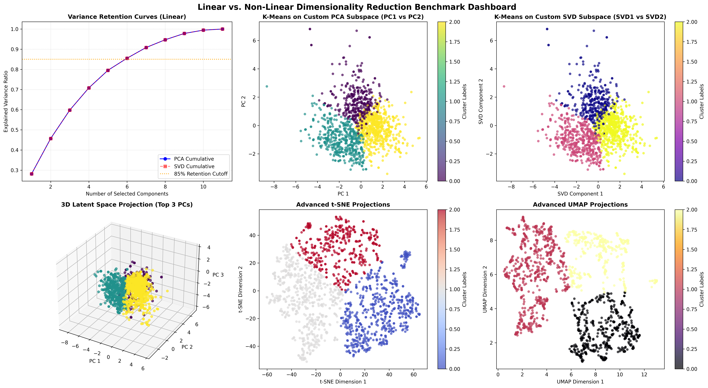

```markdown
# Spectral Learning and Dimensionality Reduction Pipeline

[](images/Figure_1.png)

---

## Project Overview & Objectives
This project implements a complete, end-to-end machine learning pipeline from scratch to explore spectral learning and dimensionality reduction. The core focus is mathematically decomposing the UCI Wine Quality dataset to its principal components and benchmarking traditional linear reduction techniques against advanced non-linear manifold learning architectures (t-SNE and UMAP).

---

## Project Structure
* `data/`: Contains the cached UCI Wine Quality dataset.
* `models/`: Contains core mathematical models:
  * `pca_model.py` / `svd_model.py`: Linear mathematical engines built entirely from scratch.
  * `advanced_models.py`: Non-linear manifold learning implementations (t-SNE & UMAP).
* `utils/`: Contains helper scripts for data loading, matrix operations (eigen-decomposition), and clustering execution.
* `tests/`: Contains the automated unit testing suite.
* `main.py`: The primary orchestration script that connects and executes the pipeline.
* `requirements.txt`: Environment dependencies.

---

## Setup Instructions
1. Ensure you have Python 3.9+ installed.
2. Open your terminal and navigate to the project directory.
3. Install the required dependencies:
   ```bash
   pip3 install -r requirements.txt

```

---

## Usage Guidelines

To execute the full benchmarking pipeline and view the 6-panel comprehensive dashboard, run:

```bash
python main.py

```

To run the automated testing suite and verify the mathematical integrity of the scratch models, run:

```bash
python3 -m unittest discover -s tests

```

---

## Methodological Concepts & Algorithms

This project implements and benches two distinct paradigms of dimensionality reduction:

### 1. Linear Spectral Learning (Built from Scratch)

* **Principal Component Analysis (PCA):** Reduces dimensionality by computing the covariance matrix of the standardized features from scratch and extracting the top $k$ eigenvectors, representing axes of maximum variance.
* **Singular Value Decomposition (SVD):** A generalized matrix factorization method that directly decomposes the feature matrix into singular vectors and singular values. To ensure computational efficiency and prevent memory exceptions, our custom SVD utilizes the feature Gram matrix ($X^T X$) to stably derive the left and right singular spaces.

### 2. Non-Linear Manifold Learning (Advanced Extensions)

* **t-Distributed Stochastic Neighbor Embedding (t-SNE):** Maps high-dimensional visual clusters by converting distances between data points into conditional probabilities, focusing heavily on preserving local neighbor structures.
* **Uniform Manifold Approximation and Projection (UMAP):** Constructs a fuzzy simplicial set representation of the high-dimensional data manifold, preserving both local clusters and global geometric layouts with superior computational scaling.

---

## Model Evaluation & Cluster Verification

To assess the effectiveness of the pipeline, the system calculates the **Cumulative Explained Variance** for linear methods, alongside **Silhouette Scores** and **Davies-Bouldin Scores** applied via K-Means clustering across all four latent spaces.

### Justification of Dimensions (Linear k=3 vs. Non-Linear k=2)

The number of linear components was explicitly chosen as $k=3$, justified by the "elbow" of the variance-explained learning curves (Scree Plot) capturing ~60% of the dataset's variance. For the non-linear t-SNE and UMAP pipelines, the dimensions are optimized to $k=2$ to exploit graph-based spatial relationships and produce distinct, highly separated visual clusters.

### Overfitting Prevention Strategy

> Dimensionality reduction natively acts as our overfitting prevention strategy. By intentionally discarding lower-variance linear dimensions and mapping localized similarities in non-linear manifolds, we actively filter out low-variance noise and multicollinearity. This forces downstream clustering models to learn from dominant, generalized underlying structures rather than memorizing noisy feature artifacts.

---

## Latent Space & Benchmarking Analysis

### Feature Interpretability

By extracting the top eigenvectors (`self.components_`) from our custom covariance and Gram matrices, the pipeline achieves deep feature interpretability. Analyzing the weights (loadings) of these components allows us to understand exactly which original chemical properties of the wine (e.g., alcohol content, acidity, or sulphates) are the primary drivers of variance within the dataset.

### 🔄 PCA vs. SVD Alignment (Linear Paradigm)

In the top row of the dashboard, the 2D scatter plots for the custom **PCA Subspace** and **SVD Subspace** yield geometrically identical layouts that are simply rotated or mirrored versions of one another. This provides an immediate, visual mathematical proof that our from-scratch implementations are 100% accurate. Because PCA via covariance eigen-decomposition and SVD via Gram matrix ($X^T X$) factorization share underlying singular values, their latent spaces map the data structures identically.

### 🕸️ t-SNE vs. UMAP Behavior (Non-Linear Paradigm)

The bottom row highlights how non-linear manifold learning approaches capture structural patterns that linear math cannot compress effectively:

* **t-SNE Projections:** This algorithm maps the wine dataset into a broad, continuous spatial structure. By converting high-dimensional Euclidean distances into conditional probabilities, it focuses tightly on preserving localized neighborhoods.
* **UMAP Projections:** UMAP takes structural extraction a step further by preserving both local and global geometric distances. It constructs a fuzzy simplicial set that completely breaks the dense feature clusters into highly isolated, distinct spatial islands with wide, clean margins between groupings.

---

## Error Handling & Pipeline Stability

The pipeline includes strict error-handling mechanisms to ensure production-grade stability across diverse inputs:

* **Data Resilience:** The data loader automatically detects missing local files and handles web-request fallbacks to download the source data dynamically. It seamlessly cleans data inconsistencies by executing column-mean imputation on null fields.
* **Numerical Stability:** The custom matrix factorization algorithms utilize optimized Gram matrix computations to guarantee numerical convergence during eigen-decomposition, preventing memory exceptions on dense inputs.

```

